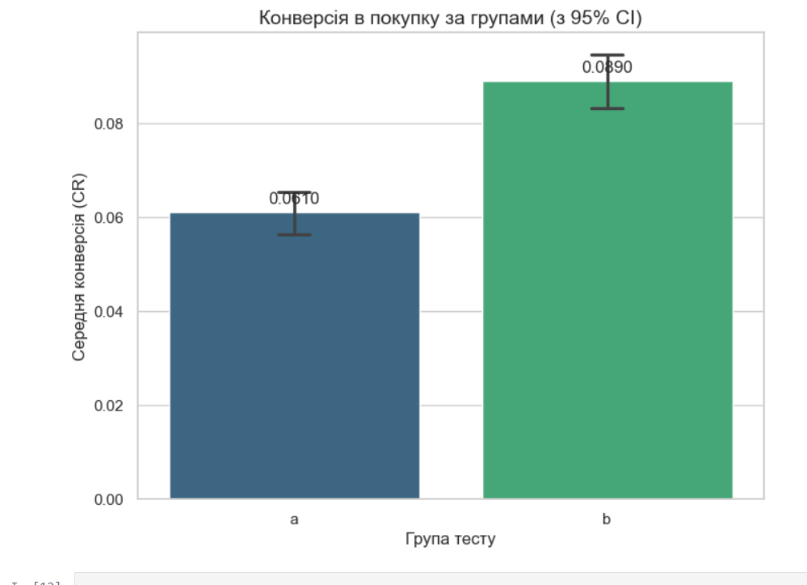
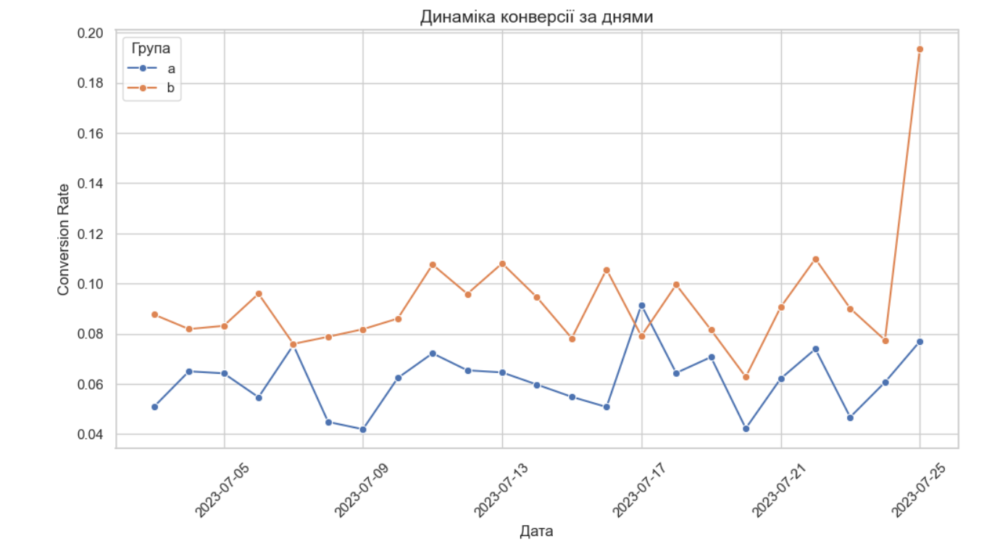

# subscription-screen-ab-testing
Statistical evaluation of an A/B test for a mobile app subscription screen using Python (SciPy, Pandas). Features hypothesis testing (Two-sample T-test), 95% Confidence Intervals, and temporal conversion trends
#  Subscription Screen A/B Testing & Statistical Inference (Python)

##  Project Overview & Objective
This project contains an end-to-end statistical validation of a mobile application's subscription checkout funnel. The primary objective was to evaluate whether introducing a visual emphasis on a **50% Discount (Group B)** yields a statistically significant increase in the Install-to-Purchase Conversion Rate (CR) compared to the standard pricing interface **(Group A)**.

---

##  Tech Stack & Methodology
* **Python 3** — Scientific programming.
* **Pandas & NumPy** — Cohort segmentation, missing value management, and daily aggregation loops.
* **SciPy (Stats module)** — Parameter testing and mathematical verification of hypothesis frameworks.
* **Matplotlib & Seaborn** — Visualizing non-overlapping error bars and timeline trends.

---

##  Experimental Setup & Metrics
* **Total Sample Size ($N$):** 19,998 synchronized unique users (split evenly ~50/50).
* **Test Duration:** 21 days (Capturing full day-of-week seasonality from 2023-07-04 to 2023-07-24).
* **Primary Metric:** Conversion Rate (CR) = Total Purchases / Total Installs.

###  Performance Summary:
* **Group A (Control):** Installs: ~9,999 | Purchases: **610** | **CR: 6.10%**
* **Group B (Test):** Installs: ~9,999 | Purchases: **890** | **CR: 8.90%**
* **Relative Conversion Lift:** **+45.9%** advantage for the discount accent group.

---

## 🔬 Statistical Validation & Hypothesis Testing

* **Hypothesis Framework:** Two-sample Student's t-test (Independent samples).
* **Test Results:** * **t-statistic:** -7.53 (Absolute magnitude confirms extreme variation from the control mean).
  * **p-value:** < 0.0001 (Significantly lower than the standard threshold $\alpha = 0.05$).
* **Statistical Decision:** Reject the Null Hypothesis ($H_0$). The conversion lift is highly robust.
* **Visual Verification:** Plotted 95% Confidence Intervals (CI) show absolute vertical separation (no overlap), validating the test's consistency.

### 📊 Conversion by Groups with 95% CI

---

## 📈 Bonus: Temporal Conversion Analysis

* **Temporal Analysis:** Plotting daily conversion trends over the 21-day timeline proved that Group B consistently outperformed Group A, eliminating the possibility of a single-day anomaly.

### 📉 Daily Conversion Rate Dynamics

##  Data-Driven Recommendations
1. **Full Scale Deployment:** Roll out the Group B design to 100% of the active user base immediately.
2. **Value Anchoring:** Apply similar psychological value framing rules to other premium checkout triggers across the app.
3. **Retention Monitoring:** Track the long-term User Retention Rate and LTV of the Group B cohort to ensure the discount did not attract lower-quality, transactional users.

---
##  Repository Contents
* `AB_Testing_Subscription_Inference.ipynb` — Complete Jupyter Notebook containing data import, filtering, statistical equations, and Seaborn visual plots.
* `README.md` — Analytical brief.

*For a comprehensive view of my analytics workflow, interactive live reports, and complete case studies, visit my **[Notion Portfolio](ВСТАВТЕ_СЮДИ_ПОСИЛАННЯ_НА_ВАШ_NOTION)**.*
